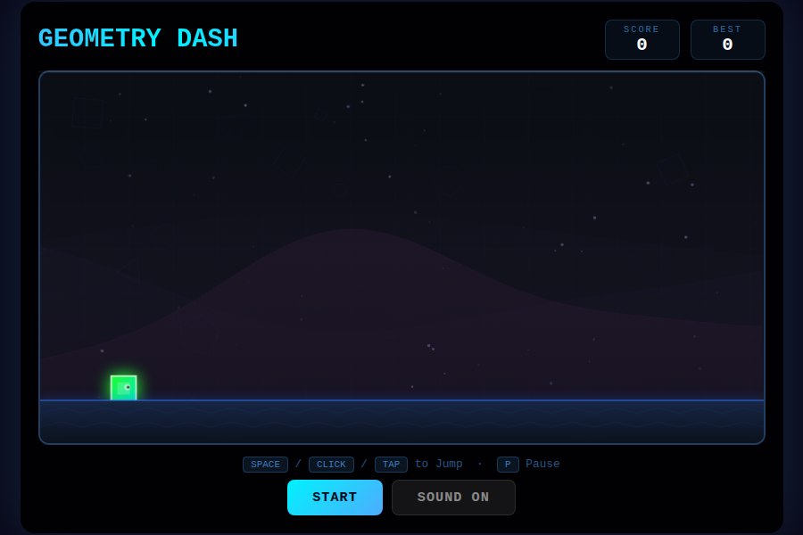
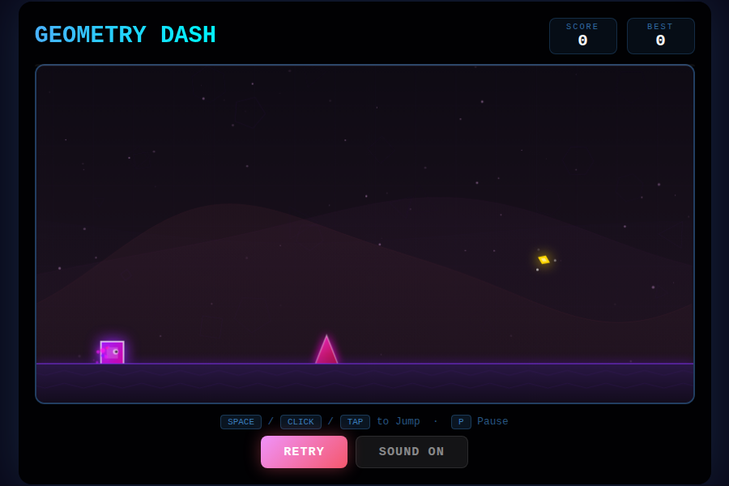
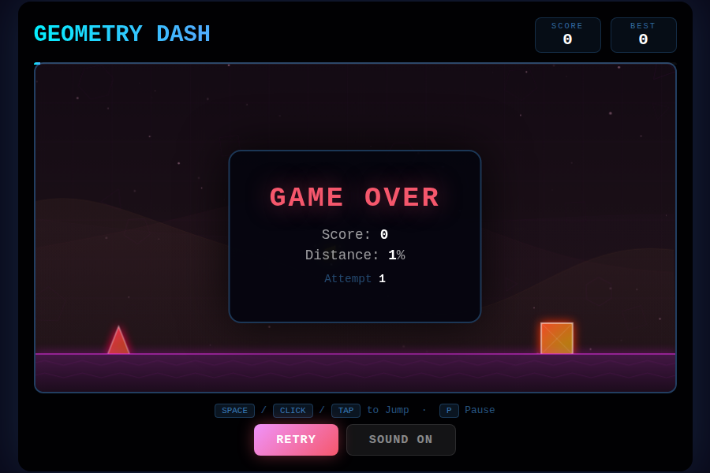

# Geometry Dash

A fast-paced 2D side-scrolling game built with HTML5 Canvas and vanilla JavaScript. No frameworks, no build tools — just open and play.





## Play

Open `index.html` in any modern browser, or serve it locally:

```bash
python3 -m http.server 8080
# then open http://localhost:8080
```

## Features

- **Smooth gameplay** with coyote time and jump buffering for tight controls
- **Rolling parallax hills** across 3 depth layers for atmospheric depth
- **Dynamic background** — hue shifts as you progress through the run
- **10 obstacle patterns** — spikes, double/triple spikes, blocks, pillars, and combos
- **Collectible golden orbs** worth bonus points with sparkle effects
- **Combo system** — chain obstacle passes for score multipliers
- **Procedural music** — 140 BPM electronic soundtrack generated in real-time via Web Audio API
- **Sound effects** — jump, land, collect, and death sounds
- **Death animation** — player shatters into spinning fragments with screen shake and flash
- **Progress bar** showing distance percentage
- **High score and attempt tracking** persisted in localStorage
- **Mobile touch support**
- **Pause/resume** with P or Escape

## Controls

| Input | Action |
|-------|--------|
| `Space` / `Arrow Up` / Click / Tap | Jump |
| `P` / `Escape` | Pause / Resume |

## Screenshots

| Title Screen | Gameplay | Game Over |
|---|---|---|
|  |  |  |

## Project Structure

```
geometry-dash/
  index.html          # Main game page
  src/
    game.js           # Game engine (player, obstacles, orbs, audio, rendering)
    style.css         # UI styling
  assets/
    screenshot-*.png  # Screenshots
  docs/
    USERGUIDE.md      # Detailed user guide
```

## Tech Stack

- **HTML5 Canvas** for rendering
- **Web Audio API** for procedural music and sound effects
- **Vanilla JavaScript** — zero dependencies
- **CSS3** with gradients and animations for the UI
- **localStorage** for high score and attempt persistence

## Browser Support

Works in all modern browsers: Chrome, Firefox, Safari, Edge. Mobile browsers supported via touch input.

## License

MIT
