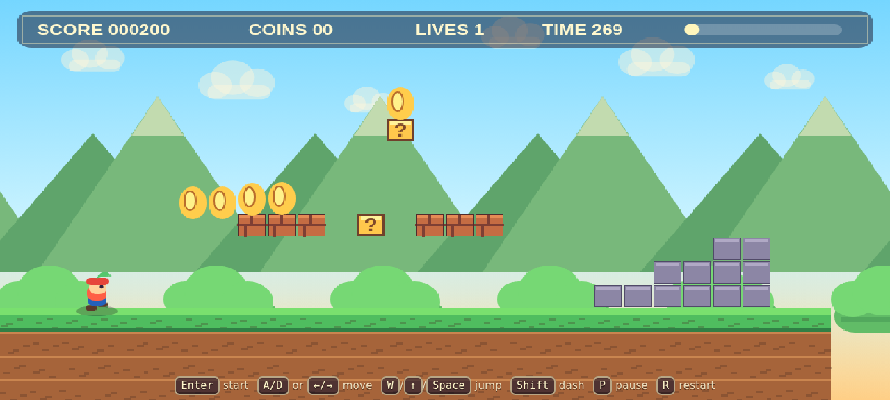

# Sprout Runner

**Sprout Runner** is an original, fullscreen, browser-based retro platformer inspired by classic side-scrolling jump-and-run games. It is built as a single self-contained HTML5 Canvas game with no framework, no build step, and no external game assets.

> This project intentionally uses original characters, art, names, and level styling. It is a Mario-style platformer clone in mechanics only, not a copy of Nintendo assets or branding.

## Live Demo

Play the deployed game here:

**https://sprout-runner.vercel.app**

This URL is also attached to the GitHub repository homepage/About link.

## Screenshot



## Features

- Fullscreen responsive browser layout
- Pixel-art inspired original visual style
- Smooth side-scrolling camera
- Hand-built tile level with pits, platforms, pipes, stairs, spikes, surprise blocks, bricks, and a goal flag
- Player physics with:
  - gravity
  - acceleration and friction
  - run/dash speed
  - coyote-time forgiving jumps
  - variable jump height
- Enemies with patrol behavior
- Stomp-to-defeat enemy interactions
- Side-contact damage, lives, respawn, and game-over state
- Coins and score tracking
- Surprise blocks with coin/power-up behavior
- Sunfruit-style power-up that grows the player
- Level timer and progress indicator
- Win state at the goal flag
- Pause, restart, title, game-over, and course-clear screens
- Keyboard controls
- Touch controls for mobile/coarse-pointer devices
- Lightweight debug API used for automated browser verification

## Controls

| Action | Keyboard |
| --- | --- |
| Start | `Enter` |
| Move | `A` / `D` or `←` / `→` |
| Jump | `W`, `↑`, or `Space` |
| Run / Dash | `Shift` |
| Pause | `P` |
| Restart | `R` |

On touch devices, on-screen buttons appear automatically for left/right movement, jump, and run.

## Tech Stack

- **HTML5**
- **CSS3**
- **Vanilla JavaScript**
- **Canvas 2D API**
- **Vercel static hosting**

No bundler, package manager, game engine, or runtime dependencies are required for the game itself.

## Project Structure

```text
sprout-runner/
├── index.html        # Complete game: markup, styles, rendering, physics, level, and input
├── README.md         # Project documentation
├── vercel.json       # Static deployment configuration
└── .gitignore        # Local/deployment artifacts to ignore
```

## Running Locally

Because the game is a self-contained static HTML file, you can open it directly:

```bash
xdg-open index.html
```

Or serve it with any static server:

```bash
python3 -m http.server 3000
```

Then open:

```text
http://localhost:3000
```

## Deployment

This repository is configured for static deployment on Vercel. Since there is no build step, Vercel serves the repository root directly.

Manual deployment with the Vercel CLI:

```bash
npx vercel --prod
```

## Gameplay Systems

### Player

The player character includes acceleration-based movement, friction, grounded checks, jump buffering/coyote-time, variable-height jumping, invulnerability after damage, and a larger powered-up state.

### Level

The level is generated in JavaScript using a tile map. Ground, pits, brick blocks, surprise blocks, pipes, stone platforms, coins, hazards, enemies, and the goal flag are all placed procedurally in the `Level.build()` method.

### Collision

The game uses axis-separated rectangle collision against solid tiles for the player, enemies, and power-ups. Pits are intentionally empty below the world bounds so falling into gaps causes a life loss and respawn.

### Enemies

Enemies patrol platforms, reverse direction at walls/edges, can be defeated by stomping from above, and damage the player on side contact.

### HUD and States

The HUD displays score, coins, lives, timer, and course progress. Game states include title, playing, paused, game over, and win.

## Browser Verification

The game exposes a small `window.__gameDebug` object for automated smoke tests. It can start the game, hold inputs, tick the simulation, teleport the player, and inspect current state. This was used to verify:

- the game starts correctly
- the canvas renders
- movement and running work
- jumping works
- coins increment score and coin count
- stomping enemies works
- side damage costs a life
- pits are lethal and respawn the player
- the goal flag triggers the win state

## License

MIT — see source for implementation details. All game code and visuals in this repository are original for this project.
